## Nama: Nahrul Wijaya
## Nim: 312010415
## Kelas: TI.20.A1

## Langkah langkah praktikum 8

1. garis MySQL Server
Untuk menjalankan MySQL Server dari menu XAMPP Control.
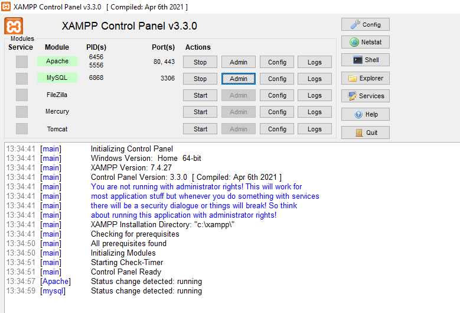

Mengakses MySQL Client menggunakan PHP MyAdmin
Pastikan webserver Apache dan server MySQL sudah dijalankan. Kemudian buka melalui browser : http://localhost/phpmyadmin/

2. Membuat Database: Studi Kasus Data Barang

Membuat database
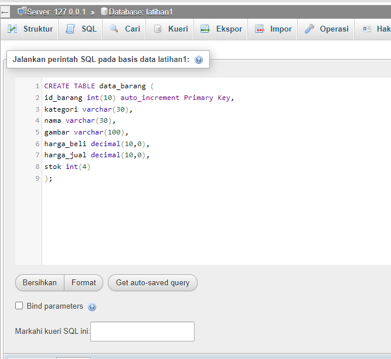

Membuat tabel
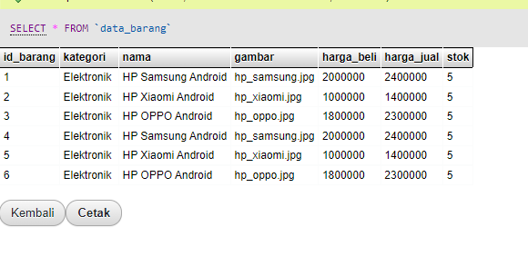

menambahkan Data
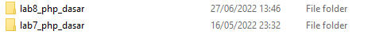

3. Membuat Program CRUD

Buat folder lab8_php_database pada root directory web server (/Application/xampp/htdocs)
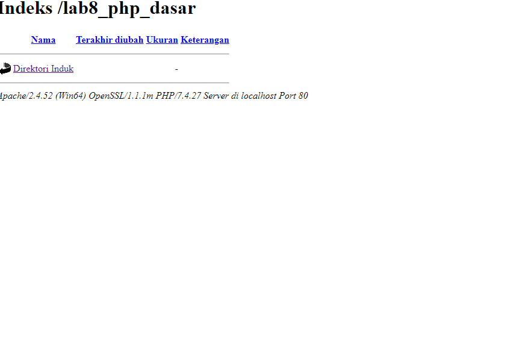

Kemudian untuk mengakses direktory tersebut pada server web dengan mengakses URL: http://localhost/lab8_php_database/
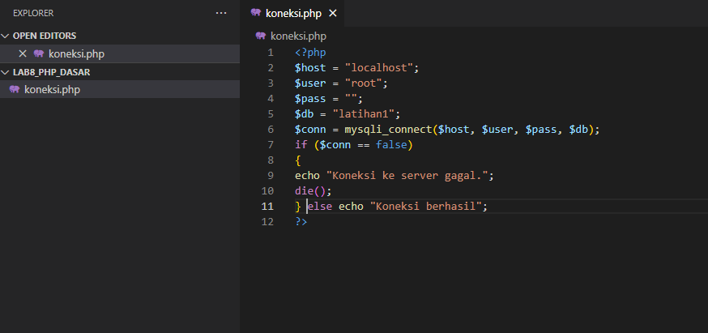

Membuat koneksi database file

Buat file baru dengan nama koneksi.php
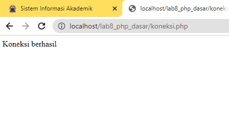

Buka melalui browser untuk menguji koneksi database (untuk menampilkan pesan koneksi berhasil, batalkan komentar pada perintah echo “koneksi berhasil”;
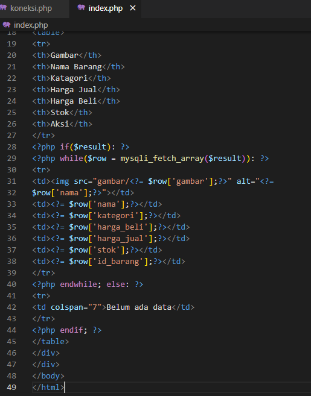

Membuat indeks file untuk menampilkan data (Baca)

Buat file baru dengan nama index.php
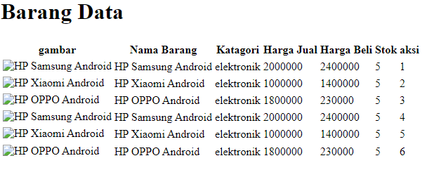

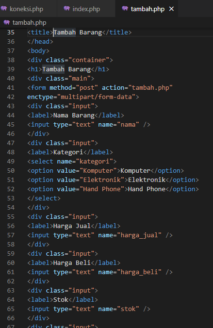

Menambah Data (Buat)

Buat file baru dengan nama tambah.php
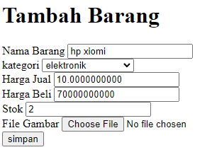

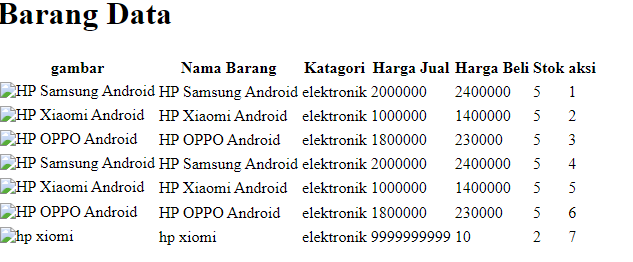

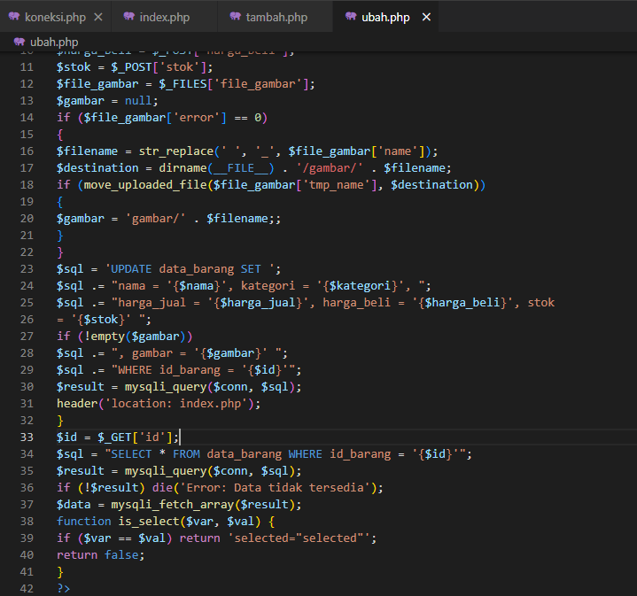

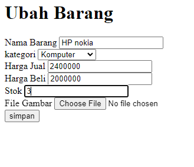

Mengubah Data (Pembaruan)

Buat file baru dengan nama ubah.php
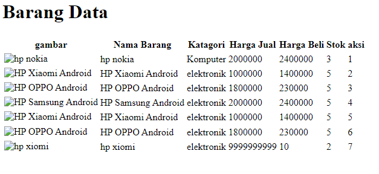

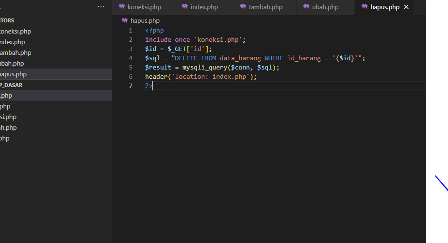

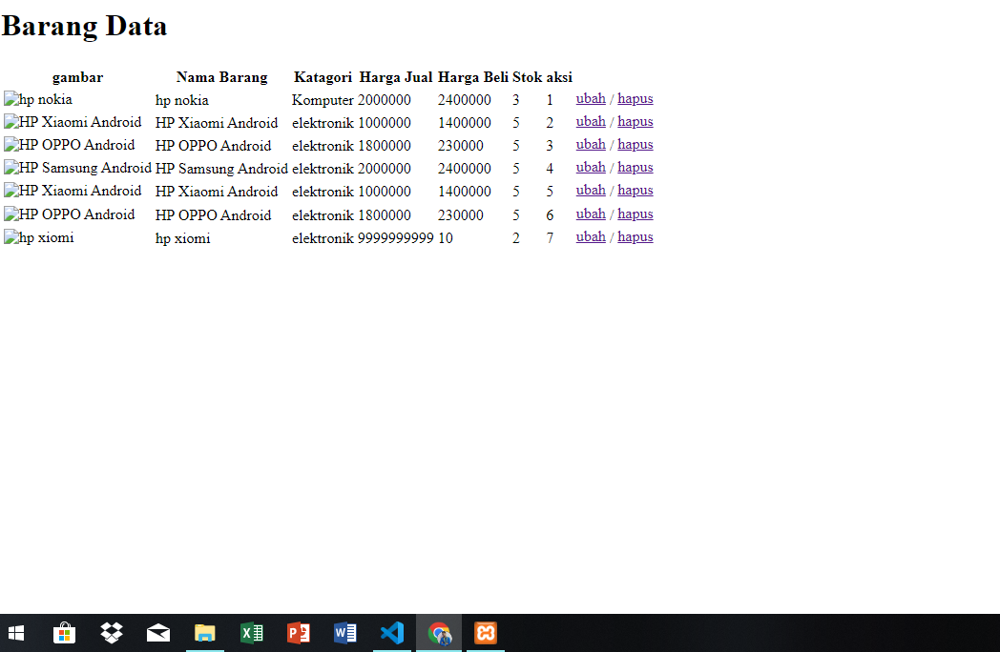

Menghapus Data (Hapus)

Buat file baru dengan nama hapus.php
